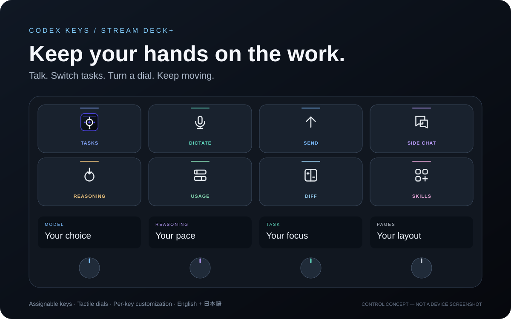
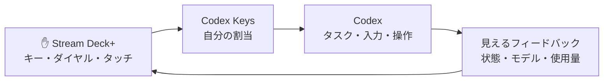

<div align="center">

# Codex Keys
### AIと働く新時代を、手元から。
**操作を探す時間から、つくる時間へ。**

[English](README.md) · 日本語

[](https://github.com/dualform-labs/codex-keys-release/actions/workflows/verify.yml) · **macOS** · **Stream Deck+** · **MIT** · **Preview**

[操作を見る](#次の操作が指先にある) · [使い始める](#使い始める) · [ビルド](#ビルドする) · [セキュリティ](SECURITY.md)

</div>



AIにできることが増えた。なら、AIとの付き合い方も進化していい。

**Codex Keysは、Stream Deck+をあなた専用のCodex操作面に変えます。** 思いつきを声にする。タスクを切り替える。モデルを選ぶ。次の指示を送る。繰り返す操作を、手が覚える場所へ。

目指すのは、AGI・ASIも視野に入る未来のAIを、直感的に扱うための物理インターフェース。いま届けるのは、具体的なタスクと入力、見えるフィードバックに向き合うCodexコントローラーです。

## 次の操作が、指先にある

| | 操作体験 | できること |
|:--:|---|---|
|  | **集中するタスクへ** | タスクを切り替え、状態をひと目で。 |
|  | **思いつきを、そのまま声に** | 音声入力のショートカットをキーごとに登録。 |
|  | **会話を止めない** | 送信を、指先の定位置へ。 |
|  | **横道のアイデアもすぐに** | サイドチャットを手元から展開。 |
|  | **考えるペースを選ぶ** | モデルや思考レベルをダイヤルで調整。 |
|  | **残量を、視界の中に** | 使用量を表示し、押した時の動作もカスタム。 |
|  | **コードとの距離を縮める** | 差分など開発操作も会話のそばに。 |
|  | **あなたの操作面に** | よく使う操作を、使う順番で配置。 |

*一覧は実際のプラグインアイコンです。冒頭の図は操作イメージで、実機スクリーンショットや固定の初期配置ではありません。*

## 話す。回す。流れを止めない。

| **話す** | **回す** | **見る** |
|---|---|---|
| キーから音声入力。準備ができたら送信。 | モデル、思考レベル、タスク、会話の操作をダイヤルへ。 | タスク状態、現在値、使用量をひと目で確認。 |



接続にはローカルCDP経由でCodexのMicro操作経路を使います。一部の操作は送信受付までしか確認できません。[接続とセキュリティの制約](SECURITY.md)をご確認ください。

## あなたのキー。あなたのリズム。

- **67の操作を自由配置。** Stream Deck標準の操作一覧から選択。
- **キーごとに英語・日本語。** 表示名、外観、フィードバックも設定。
- **表示系キーにも役割を。** 使用量などを押した時の動作をカスタム。
- **音声ショートカットを実際に押して登録。** 左右の修飾キーにも対応。
- **ダイヤルも調整。** 方向、ステップ、対応するタッチ・押下操作を設定。
- **設定はすべてStream Deck内。** 別のWeb設定画面は不要。

タスクスロットは直近のCodexウィンドウ内で切り替えます。ACT06〜ACT12はCodexの割当に従う互換キー識別子です。既存プロファイルとの互換性のため、内部UUIDは `io.local.codexdeck.microplus` を維持しています。

## 使い始める

> **現在はPreviewです。** 音声入力は0.1.0.60、圧縮は0.1.0.62で利用者の実機成功を確認しています。全67操作と再起動後の復帰の網羅的な実機確認は未完了です。ローカルCDP接続の認証制約も残っています。

1. **Stream Deckのプロファイルをバックアップ。**
2. **公開後の[Releases](https://github.com/dualform-labs/codex-keys-release/releases)からパッケージを取得。** Draftは管理者向けです。ソースからビルドすることもできます。
3. **`.streamDeckPlugin`を開いて導入。** Stream Deckで操作を配置します。
4. **キーを設定してCodexへの接続を確認。** プラグイン導入だけで接続が成立するわけではありません。[導入説明](RELEASE_NOTES.ja.md)と[接続ガイド（英語）](packages/microplus/README.md)を参照してください。

macOS、Stream Deck+、互換性のあるCodex desktopが必要です。公開操作APIではないため、Codexの更新で互換性が変わる場合があります。

<details>
<summary><strong>音声入力：登録するショートカットについて</strong></summary>

アプリ側の**録音切替**のショートカットを登録します。「押している間だけ録音」とは異なります。初期値は右Optionです。設定画面で実際に押して離すとキーごとに保存され、Escapeやフォーカス移動で中止できます。

プラグインは押下と解放で1回ずつ録音切替を送ります。録音停止中から使い、押下中にアプリ側で手動切替をしないでください。録音状態の直接確認はありません。左右の修飾キー、英数字、Space、Enter、F1〜F12などに対応します。

</details>

## ビルドする

```sh
npm ci
npm ci --prefix packages/microplus
npm run check
npm test
npm run microplus:pack
```

macOSとSwiftコンパイラーが必要です。パッケージは `packages/microplus/dist/` に生成されます。自動テスト・CIと実機の受け入れは別に扱います。[公開前チェックリスト（英語）→](RELEASE_CHECKLIST.md)

<details>
<summary><strong>プロジェクトの構成</strong></summary>

| パス | 役割 |
|---|---|
| `packages/microplus/src/` | 入力・接続・状態・描画 |
| `packages/microplus/static/property-inspector/` | Stream Deck内の設定 |
| `packages/microplus/launcher/` | 明示的な接続・起動支援 |
| `packages/microplus/native/` | 登録ショートカットの押下・解放 |
| `packages/discovery/`, `packages/desktop/` | 調査・検証アダプター |
| `scripts/` | ビルド検査・プロファイル管理 |

公開用ソースは個人用の作業記録と開発履歴を除外しています。旧Web manager、エージェント司令塔、予約、リモート中継は製品に含みません。

</details>

## リスペクトとともに

[MITライセンス](LICENSE) · [第三者の帰属](packages/microplus/THIRD_PARTY_NOTICE.md) · [セキュリティ](SECURITY.md)

Micro互換接続の基線にはMITライセンスの [dazer1234/codex-stream-deck](https://github.com/dazer1234/codex-stream-deck) を使用し、ライセンスと帰属を保持しています。

**Codex Keysは独立した非公式プロジェクトです。** OpenAI、Elgato、Work Louderの公式製品ではありません。
