<div align="center">

# AGI Keys
<p align="center">
  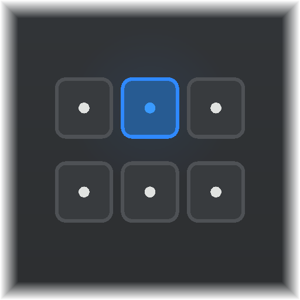
</p>

### Stream Deck+から、Codexを指で回す。
**話す。回す。待ちも、キーの上で見える。**

[English](README.md) · 日本語

[](https://github.com/dualform-labs/agi-keys-release/actions/workflows/verify.yml) · **macOS** · **Stream Deck+** · **MIT** · **Preview**

[製品ページ](https://dualformai.com/agi-keys/) · [操作を見る](#チャット窓を探さない) · [使い始める](#使い始める) · [ビルド](#ビルドする) · [セキュリティ](SECURITY.md)

</div>

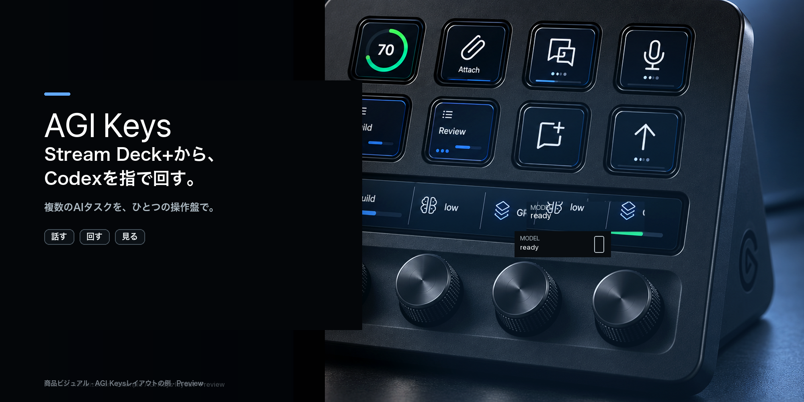

Codexをキーボードだけで使う時代は、ここで終わる——別のチャットタブではなく、手がすでに知っている操作面へ。

**複数のAIタスクを、ひとつの操作盤で。**

長いあいだ、AIとの仕事は「窓に打つ → 待つ → スクロール → スレッドを探す → 状態を追う」だった。AGI Keysはそのループを Stream Deck+ へ移す。次の一手を声にし、ダイヤルでモデルと思考を回し、準備ができたら送り、タスクの状態と待ちの手がかりを、視線をデスクから外さずに置く。

これは厚いプロンプト窓ではない。macOS上のCodexのための物理操作盤だ——非公式で、焦点が狭く、Previewであることを隠さない。境界がはっきりしているほど、信頼は積み上がる。


<p align="center">
  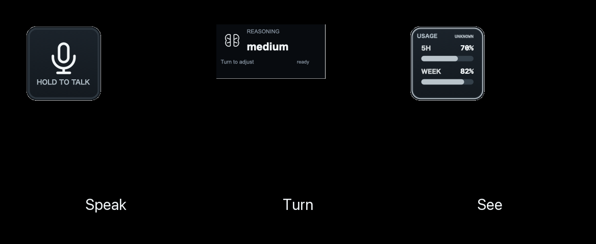
</p>

<p align="center"><sub>話す · 回す · 見る — 稼働中プラグインUIからのレンダ（デモ状態）。</sub></p>

## チャット窓を探さない

| | その瞬間 | 指先に来るもの |
|:--:|---|---|
| 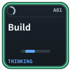 | **集中するタスクへ** | タスクを切り替え、状態をひと目で。 |
| 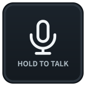 | **思いつきを、そのまま声に** | キーごとに登録した音声ショートカット。 |
| 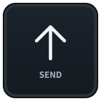 | **会話を止めない** | 送信を、指先の定位置へ。 |
|  | **横道のアイデアも同じリズムで** | サイドチャットを手元から。 |
| 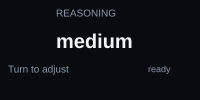 | **考えるペースを選ぶ** | モデルや思考レベルをダイヤルで。 |
| 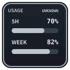 | **残量を、視界の中に** | 使用量を表示し、押した時の動作もカスタム。 |
| 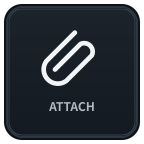 | **コードとの距離を縮める** | 開発操作も会話のそばに。 |
| 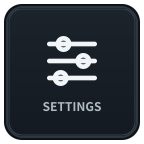 | **あなたの操作面に** | 繰り返す操作だけを、使う順で。 |

*冒頭は稼働中プラグインUIに基づく商品ビジュアル（AGI Keysレイアウトの例）です。タスク名はサンプルで、細部は実機と異なる場合があります。表のアイコンはキーキャップ／ダイヤルの実レンダ（デモ状態）で、ライブのCodex状態ではありません。*


### プラグインUIのモーション

<p align="center">
  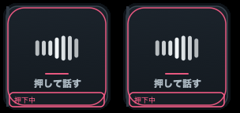
  &nbsp;
  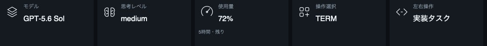<br>
  <sub>Speak / Turn のモーションプレビュー（プラグイン検証レンダ）。</sub>
</p>

### 稼働UIから

<p align="center">
  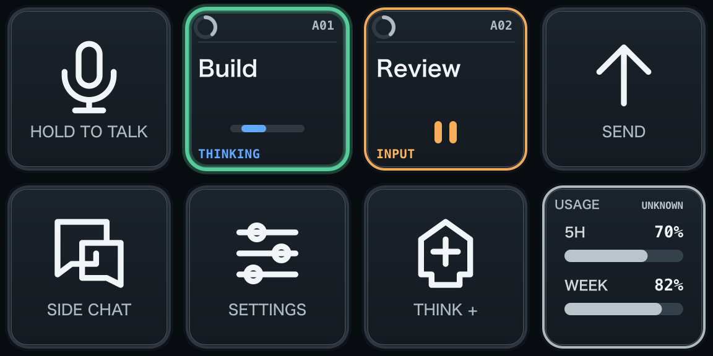<br>
  <sub>キー面 — 音声、タスク状態、送信、使用量（デモ表示）。</sub>
</p>

<p align="center">
  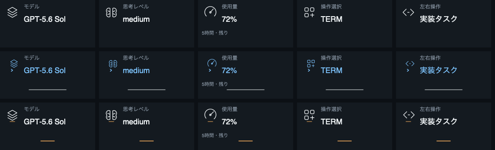<br>
  <sub>回す — モデル、思考レベル、使用量、タスクのダイヤルフィードバック。</sub>
</p>

<p align="center">
  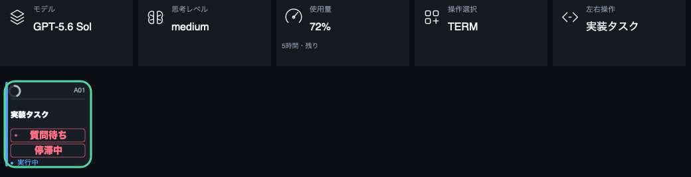<br>
  <sub>見る — 値はダイヤル帯に残り、メニューを探さない。</sub>
</p>

<p align="center">
  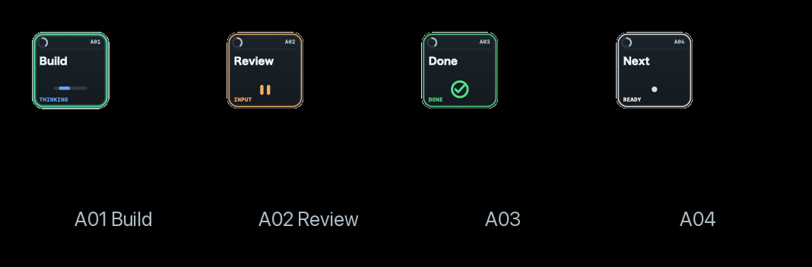
  &nbsp;
  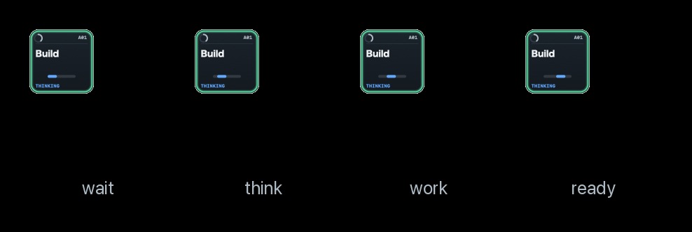<br>
  <sub>タスクスロットと待ちの手がかり — 視界に残るループ。</sub>
</p>

<p align="center">
  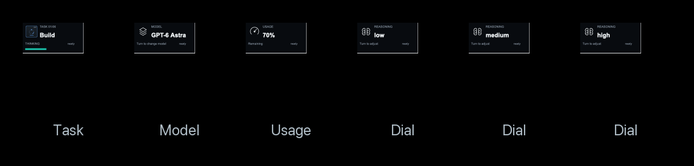<br>
  <sub>LCD＋ダイヤルのプラグイン実レンダ（ライブのCodex状態ではない）。</sub>
</p>

## 話す。回す。見る。

動詞は三つ。ループは一つ。

| **話す** | **回す** | **見る** |
|---|---|---|
| キー一押しで、思いつきが声になる。準備ができたら送信。 | モデル、思考レベル、タスク、会話をダイヤルへ——掘らずに回す。 | タスク状態、現在値、使用量、待ちの手がかりが視界に残る。メニュー探しはしない。 |

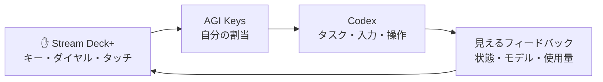

操作を探す時間から、つくる時間へ。接続にはローカルCDP経由でCodexのMicro操作経路を使います。一部の操作は送信受付までしか確認できません——先に言います。[接続とセキュリティの制約](SECURITY.md)をご確認ください。


### 67の操作を自由配置

<p align="center">
  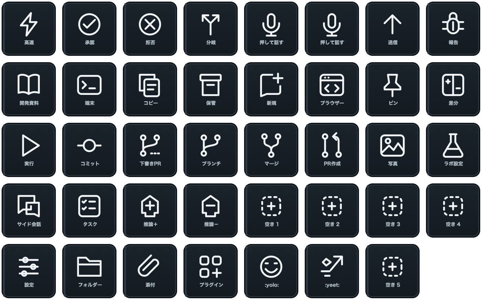<br>
  <sub>プラグインの操作カタログ — 自分が回すデッキを組む。</sub>
</p>

## あなたのキー。あなたのリズム。

- **67の操作を自由配置。** Stream Deck標準の操作一覧から、自分が回すデッキを組む。
- **キーごとに英語・日本語。** 表示名、外観、フィードバックも設定。
- **表示系キーにも役割を。** 使用量などを押した時の動作をカスタム。
- **音声ショートカットを実際に押して登録。** 左右の修飾キーにも対応。
- **ダイヤルも調整。** 方向、ステップ、対応するタッチ・押下操作を設定。
- **設定はすべてStream Deck内。** 別のWeb設定画面は不要。

タスクスロットは直近のCodexウィンドウ内で切り替えます。ACT06〜ACT12はCodexの割当に従う互換キー識別子です。プラグインUUID名前空間は `com.dualform.agikeys` です。旧開発UUIDを参照する事前検証用プロファイルでは、AGI Keysの操作を再配置してください。

## 使い始める

> **現在はPreviewです。その正直さ自体を、製品の一部にしています。** 音声入力は0.1.0.60、圧縮は0.1.0.62で利用者の実機成功を確認しています。全67操作と再起動後の復帰の網羅的な実機確認は未完了です。ローカルCDP接続の認証制約も残っています。売り切るより、境界を見せて信頼を積む方を選びます。

1. **Stream Deckのプロファイルをバックアップ。**
2. **[Releases](https://github.com/dualform-labs/agi-keys-release/releases)からパッケージを取得。** Draftは管理者向けです。ソースからビルドすることもできます。
3. **`.streamDeckPlugin`を開いて導入。** Stream Deckで操作を配置します。
4. **キーを設定してCodexへの接続を確認。** プラグイン導入だけで接続が成立するわけではありません。[導入説明](RELEASE_NOTES.ja.md)と[接続ガイド（英語）](packages/microplus/README.md)を参照してください。

macOS、Stream Deck+、互換性のあるCodex desktopが必要です。公開操作APIではないため、Codexの更新で互換性が変わる場合があります。

製品ページ: [https://dualformai.com/agi-keys/](https://dualformai.com/agi-keys/)

<details>
<summary><strong>音声入力：登録するショートカットについて</strong></summary>

アプリ側の**録音切替**のショートカットを登録します。「押している間だけ録音」とは異なります。初期値は右Optionです。設定画面で実際に押して離すとキーごとに保存され、Escapeやフォーカス移動で中止できます。

プラグインは押下と解放で1回ずつ録音切替を送ります。録音停止中から使い、押下中にアプリ側で手動切替をしないでください。録音状態の直接確認はありません。左右の修飾キー、英数字、Space、Enter、F1〜F12などに対応します。

</details>

## ビルドする

```sh
npm ci
npm ci --prefix packages/microplus
npm run check
npm test
npm run microplus:pack
```

macOSとSwiftコンパイラーが必要です。パッケージは `packages/microplus/dist/` に生成されます。自動テスト・CIと実機の受け入れは別に扱います。[公開前チェックリスト（英語）→](RELEASE_CHECKLIST.md)

<details>
<summary><strong>プロジェクトの構成</strong></summary>

| パス | 役割 |
|---|---|
| `packages/microplus/src/` | 入力・接続・状態・描画 |
| `packages/microplus/static/property-inspector/` | Stream Deck内の設定 |
| `packages/microplus/launcher/` | 明示的な接続・起動支援 |
| `packages/microplus/native/` | 登録ショートカットの押下・解放 |
| `packages/discovery/`, `packages/desktop/` | 調査・検証アダプター |
| `scripts/` | ビルド検査・プロファイル管理 |

公開用ソースは個人用の作業記録と開発履歴を除外しています。旧Web manager、エージェント司令塔、予約、リモート中継は製品に含みません——意図的に。製品は操作盤そのものです。

</details>


<p align="center">
  <a href="https://dualformai.com/agi-keys/">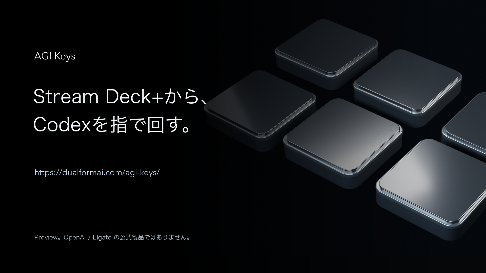</a>
</p>


<p align="center">
  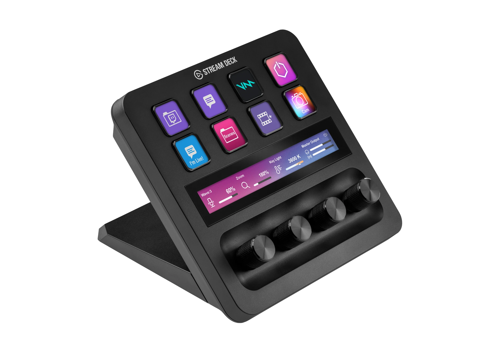<br>
  <sub>ハードウェア写真: Stream Deck+ device photography © Elgato/Corsair（メディアキット）。本リポジトリのMIT対象外。AGI Keysは独立ソフトウェアであり、Elgato製品ではない。サイト上のUI重ねは別途プラグイン実レンダ。</sub>
</p>

## リスペクトとともに

[MITライセンス](LICENSE) · [第三者の帰属](packages/microplus/THIRD_PARTY_NOTICE.md) · [セキュリティ](SECURITY.md) · [製品ページ](https://dualformai.com/agi-keys/)

Micro互換接続の基線にはMITライセンスの [dazer1234/codex-stream-deck](https://github.com/dazer1234/codex-stream-deck) を使用し、ライセンスと帰属を保持しています。

**AGI Keysは独立した非公式のPreviewです。** OpenAIでも、Elgatoでも、Work Louderでもない。Codexを、手元の静かな自信で回すための面です。
