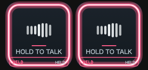
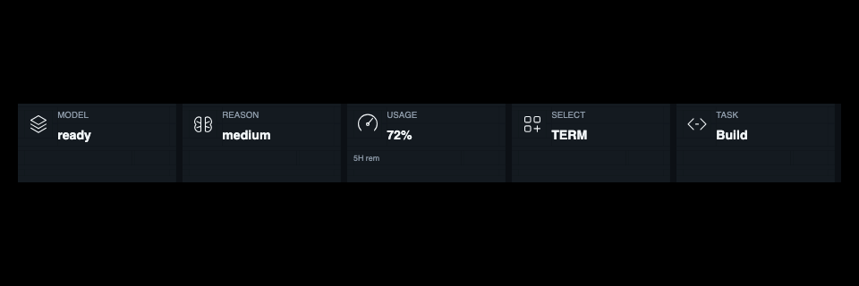
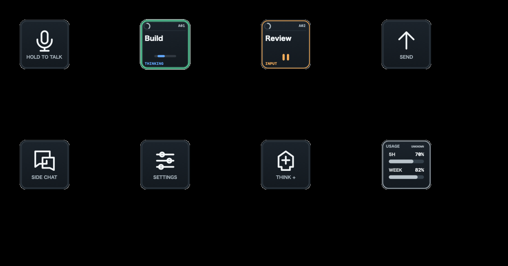
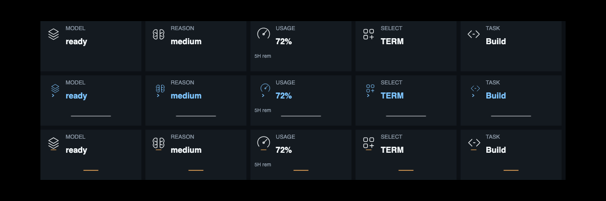
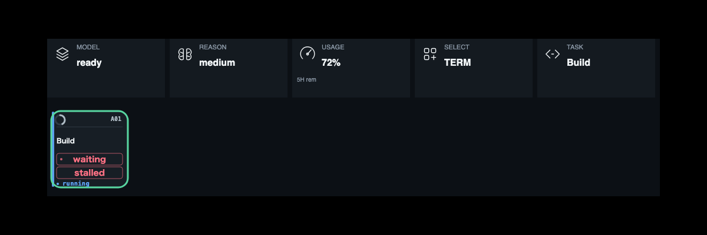
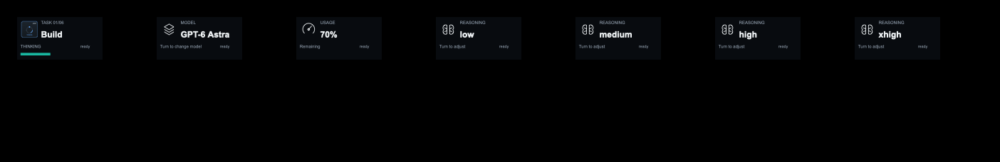
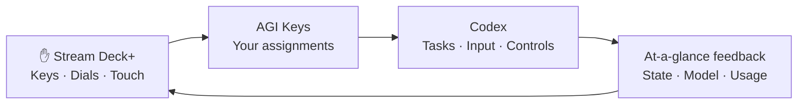
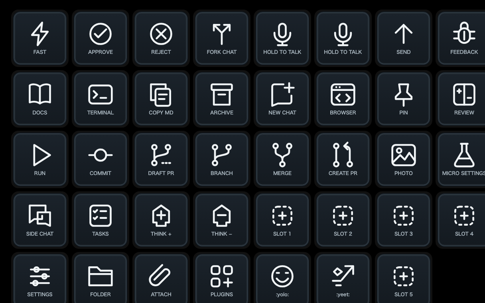
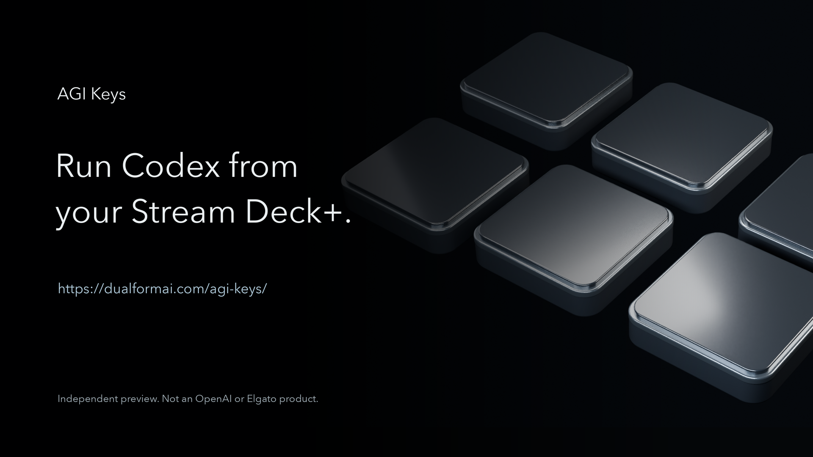

<div align="center">

# AGI Keys
<p align="center">
  
</p>

### Run Codex from your Stream Deck+.
**Speak. Turn. See waiting state on the keys.**

English · [日本語](README.ja.md)

[](https://github.com/dualform-labs/agi-keys-release/actions/workflows/verify.yml) · **macOS** · **Stream Deck+** · **MIT** · **Preview**

[Product page](https://dualformai.com/agi-keys/) · [Explore the controls](#stop-hunting-the-chat-window) · [Get started](#get-started) · [Build](#build-it) · [Security](SECURITY.md)

</div>


The keyboard-only Codex era ends here—not with another chat tab, but with a surface your hands already understand.

**Multiple AI tasks. One control surface.**

For years, working with AI meant typing into a window, waiting, scrolling, switching threads, hunting status. AGI Keys moves that loop onto Stream Deck+: speak the next move, turn model and reasoning on dials, send when ready, and keep task state and waiting cues where your eyes land without leaving the desk.

This is not a thicker prompt box. It is a physical control deck for Codex on macOS—unofficial, focused, and honest about being Preview. When the boundaries are clear, trust compounds.


<p align="center">
  
</p>

<p align="center"><sub>Speak · Turn · See — renders from the running plugin UI (demonstration states).</sub></p>

## Stop hunting the chat window

| | The moment | What lands under your fingers |
|:--:|---|---|
|  | **Find your focus** | Switch tasks and read their state at a glance. |
|  | **Speak your next move** | Dictation on a key you press—your shortcut, per key. |
|  | **Keep the conversation moving** | Send stays at fingertip reach. |
|  | **Open a side thought** | Side chat enters the same physical rhythm. |
|  | **Set the pace** | Model and reasoning turn on dials. |
|  | **Know where you stand** | Usage stays visible; press behavior is yours. |
|  | **Stay close to the code** | Development controls sit beside the conversation. |
|  | **Make the deck yours** | Arrange the actions you actually repeat. |

*Hero is a product visualization based on the running plugin UI (example AGI Keys layout). Task names are samples; fine details may differ from hardware. Table icons are plugin keycap/dial renders at demonstration states—not live Codex status.*


### Motion from the plugin UI

<p align="center">
  
  &nbsp;
  <br>
  <sub>Speak / Turn motion previews from plugin verification renders.</sub>
</p>

### From the running UI

<p align="center">
  <br>
  <sub>Key surfaces — dictation, task state, send, usage (demonstration).</sub>
</p>

<p align="center">
  <br>
  <sub>Turn — model, reasoning, usage and task dial feedback.</sub>
</p>

<p align="center">
  <br>
  <sub>See — values stay on the dial strip without hunting menus.</sub>
</p>

<p align="center">
  
  &nbsp;
  <br>
  <sub>Task slots and waiting cues — the loop you keep in view.</sub>
</p>

<p align="center">
  <br>
  <sub>LCD + dial renders from the plugin (not live Codex status).</sub>
</p>

## Speak. Turn. See.

Three verbs. One loop.

| **Speak** | **Turn** | **See** |
|---|---|---|
| An idea becomes voice at a key press. Send when the thought is ready. | Model, reasoning, task, and conversation controls live on dials—twist, don't dig. | Task state, current values, usage, and waiting cues stay in view. No menu safari. |



Less reaching. More creating. The connector uses Codex's native Micro path over local CDP. Some actions expose only dispatch acceptance rather than complete downstream confirmation—we say so up front. See [connection and security limits](SECURITY.md).


### 67 actions to arrange

<p align="center">
  <br>
  <sub>Action catalog from the plugin — arrange the deck you actually work.</sub>
</p>

## Your keys. Your rhythm.

- **67 actions to arrange** in Stream Deck's native action list—build the deck you work, not a fixed grid someone else imagined.
- **Per-key English or Japanese**, labels, appearance, and feedback.
- **Custom press behavior** for display actions such as usage.
- **Record your own dictation shortcut**, including left/right modifiers.
- **Dial settings** for direction, steps, and supported touch/press gestures.
- **Everything in Stream Deck.** No separate web settings app to babysit.

Task slots follow the recent Codex window. ACT06–ACT12 are compatibility key identifiers whose behavior follows Codex's mapping. The plugin UUID namespace is `com.dualform.agikeys`. Pre-release profiles that used the former development UUID must assign AGI Keys actions again.

## Get started

> **Preview, with honest boundaries—and that honesty is part of the product.** Hardware success has been reported for dictation on 0.1.0.60 and compaction on 0.1.0.62. All 67 actions and restart recovery have not passed exhaustive hardware acceptance. The connector's local CDP authentication limitation remains open. We would rather earn trust than oversell a finish line.

1. **Back up your Stream Deck profiles.**
2. **Get a preview package** from [Releases](https://github.com/dualform-labs/agi-keys-release/releases) when one is published. Draft releases are visible only to maintainers; you can also build from source.
3. **Open the `.streamDeckPlugin` file**, then arrange actions in Stream Deck.
4. **Configure your keys** and verify the Codex connection. Installing the plugin alone does not establish it; read [installation notes](RELEASE_NOTES.md) and the [connector guide](packages/microplus/README.md).

Requires macOS, Stream Deck+, and a compatible Codex desktop version. Codex updates can change compatibility because this is not a public operation API.

Start at the product page: [https://dualformai.com/agi-keys/](https://dualformai.com/agi-keys/)

<details>
<summary><strong>Voice input: choose the right shortcut</strong></summary>

Register the receiving app's **toggle recording** shortcut, not its hold-to-talk shortcut. The default is Right Option. Press and release the shortcut in the property inspector to save it per key; Escape or loss of focus cancels capture.

The plugin sends a toggle on key-down and another on key-up. Start with recording stopped and avoid manually toggling it while holding the key. The receiving app does not directly acknowledge recording state. Supported bindings include left/right modifiers, letters, digits, Space, Enter and F1–F12.

</details>

## Build it

```sh
npm ci
npm ci --prefix packages/microplus
npm run check
npm test
npm run microplus:pack
```

Build on macOS with a Swift compiler. The plugin package is generated in `packages/microplus/dist/`. Tests and CI verify code and packaging; they are not substitutes for real-device acceptance. [Release checklist →](RELEASE_CHECKLIST.md)

<details>
<summary><strong>Inside the project</strong></summary>

| Path | Purpose |
|---|---|
| `packages/microplus/src/` | Input, connection, state and rendering |
| `packages/microplus/static/property-inspector/` | Native Stream Deck settings |
| `packages/microplus/launcher/` | Explicit connection and launch assistance |
| `packages/microplus/native/` | Registered shortcut press/release |
| `packages/discovery/`, `packages/desktop/` | Investigation and verification adapters |
| `scripts/` | Build checks and profile tools |

The public source export excludes private work records and development history. The retired web manager, managed-agent orchestration, scheduling and remote relay are outside the product scope—on purpose. The deck is the product.

</details>


<p align="center">
  <a href="https://dualformai.com/agi-keys/"></a>
</p>


<p align="center">
  <br>
  <sub>Hardware plate: Stream Deck+ device photography © Elgato/Corsair (media kit). Not covered by this repo’s MIT license. AGI Keys is independent software — not an Elgato product. UI overlays on the live site are separate plugin renders.</sub>
</p>

## Built with respect

[MIT license](LICENSE) · [Third-party notices](packages/microplus/THIRD_PARTY_NOTICE.md) · [Security](SECURITY.md) · [Product page](https://dualformai.com/agi-keys/)

The Micro-compatible connection baseline uses MIT-licensed [dazer1234/codex-stream-deck](https://github.com/dazer1234/codex-stream-deck). Original license and attribution are preserved.

**AGI Keys is an independent, unofficial Preview.** Not OpenAI. Not Elgato. Not Work Louder. A quieter way to run Codex—with your hands on the work.
