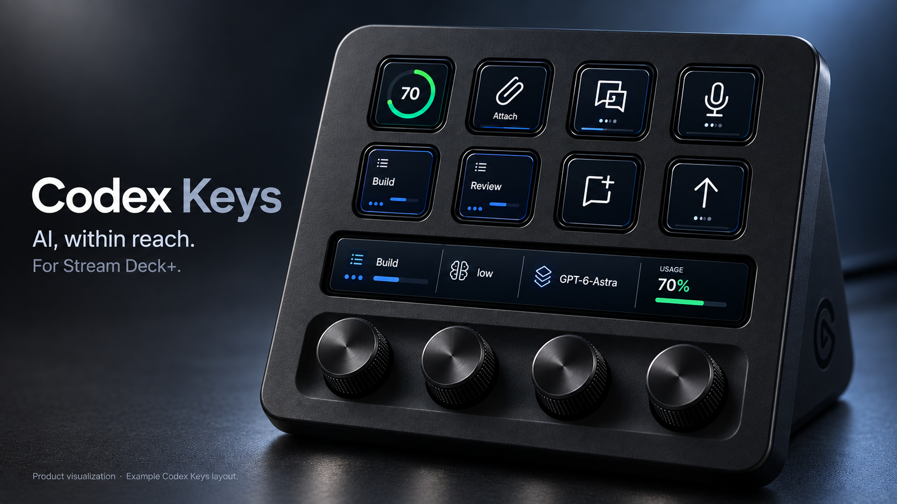
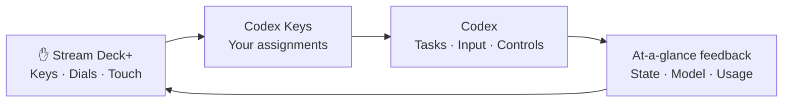

<div align="center">

# Codex Keys
### A physical interface for the agentic era.
**Less reaching. More creating. AI at your fingertips.**

English · [日本語](README.ja.md)

[](https://github.com/dualform-labs/codex-keys-release/actions/workflows/verify.yml) · **macOS** · **Stream Deck+** · **MIT** · **Preview**

[Explore the controls](#your-next-action-within-reach) · [Get started](#get-started) · [Build](#build-it) · [Security](SECURITY.md)

</div>



AI can do more. The way we work with it should move forward, too.

**Codex Keys turns your Stream Deck+ into a personal control surface for Codex.** Speak an idea, switch your focus, adjust a model, send the next instruction. Keep the actions you repeat in places your hands remember.

Our vision is a tactile interface for increasingly capable AI—including a future shaped by AGI and ASI. Today's product is a focused Codex controller, built around real tasks, real input and visible feedback.

## Your next action, within reach

| | The experience | What it gives you |
|:--:|---|---|
|  | **Find your focus** | Switch tasks and see their state. |
|  | **Speak your next move** | Register your dictation shortcut per key. |
|  | **Keep the conversation moving** | Put send within fingertip reach. |
|  | **Explore a side thought** | Bring side chat into your physical workflow. |
|  | **Set the pace** | Adjust model and reasoning with dial controls. |
|  | **Know where you stand** | Keep usage visible; choose the press action. |
|  | **Stay close to the code** | Place development controls beside the conversation. |
|  | **Make it yours** | Arrange the actions you use around your workflow. |

*The hero is a CG product visualization based on the running plugin UI. It shows an example layout with four Codex Keys dials, including usage on the right. Task names are examples; fine details may differ from the hardware. Icons in this table are the plugin’s action-list assets, not screenshots of its dynamic key displays.*

## Talk. Turn. Keep moving.

| **Talk** | **Turn** | **See** |
|---|---|---|
| Dictation at a key press. Send when you're ready. | Model, reasoning, task and conversation controls on dials. | Task state, current values and usage without hunting through menus. |



The connector uses Codex's native Micro operation path over local CDP. Some actions expose only dispatch acceptance rather than complete downstream confirmation. See [connection and security limits](SECURITY.md).

## Your keys. Your rhythm.

- **67 actions to arrange** in Stream Deck's native action list.
- **Per-key English or Japanese**, labels, appearance and feedback options.
- **Custom press behavior** for display actions such as usage.
- **Record your own dictation shortcut**, including left/right modifiers.
- **Dial settings** for direction, steps and supported touch/press gestures.
- **Everything in Stream Deck.** No separate web settings app.

Task slots follow the recent Codex window. ACT06–ACT12 are compatibility key identifiers whose behavior follows Codex's mapping. The internal UUID stays `io.local.codexdeck.microplus` to preserve existing profile compatibility.

## Get started

> **Preview, with honest boundaries.** Hardware success has been reported for dictation on 0.1.0.60 and compaction on 0.1.0.62. All 67 actions and restart recovery have not passed exhaustive hardware acceptance. The connector's local CDP authentication limitation remains open.

1. **Back up your Stream Deck profiles.**
2. **Get a preview package** from [Releases](https://github.com/dualform-labs/codex-keys-release/releases) when one is published. Draft releases are visible only to maintainers; you can also build from source.
3. **Open the `.streamDeckPlugin` file**, then arrange actions in Stream Deck.
4. **Configure your keys** and verify the Codex connection. Installing the plugin alone does not establish it; read [installation notes](RELEASE_NOTES.md) and the [connector guide](packages/microplus/README.md).

Requires macOS, Stream Deck+ and a compatible Codex desktop version. Codex updates can change compatibility because this is not a public operation API.

<details>
<summary><strong>Voice input: choose the right shortcut</strong></summary>

Register the receiving app's **toggle recording** shortcut, not its hold-to-talk shortcut. The default is Right Option. Press and release the shortcut in the property inspector to save it per key; Escape or loss of focus cancels capture.

The plugin sends a toggle on key-down and another on key-up. Start with recording stopped and avoid manually toggling it while holding the key. The receiving app does not directly acknowledge recording state. Supported bindings include left/right modifiers, letters, digits, Space, Enter and F1–F12.

</details>

## Build it

```sh
npm ci
npm ci --prefix packages/microplus
npm run check
npm test
npm run microplus:pack
```

Build on macOS with a Swift compiler. The plugin package is generated in `packages/microplus/dist/`. Tests and CI verify code and packaging; they are not substitutes for real-device acceptance. [Release checklist →](RELEASE_CHECKLIST.md)

<details>
<summary><strong>Inside the project</strong></summary>

| Path | Purpose |
|---|---|
| `packages/microplus/src/` | Input, connection, state and rendering |
| `packages/microplus/static/property-inspector/` | Native Stream Deck settings |
| `packages/microplus/launcher/` | Explicit connection and launch assistance |
| `packages/microplus/native/` | Registered shortcut press/release |
| `packages/discovery/`, `packages/desktop/` | Investigation and verification adapters |
| `scripts/` | Build checks and profile tools |

The public source export excludes private work records and development history. The retired web manager, managed-agent orchestration, scheduling and remote relay are outside the product scope.

</details>

## Built with respect

[MIT license](LICENSE) · [Third-party notices](packages/microplus/THIRD_PARTY_NOTICE.md) · [Security](SECURITY.md)

The Micro-compatible connection baseline uses MIT-licensed [dazer1234/codex-stream-deck](https://github.com/dazer1234/codex-stream-deck). Original license and attribution are preserved.

**Codex Keys is an independent, unofficial project.** It is not an OpenAI, Elgato or Work Louder product.
